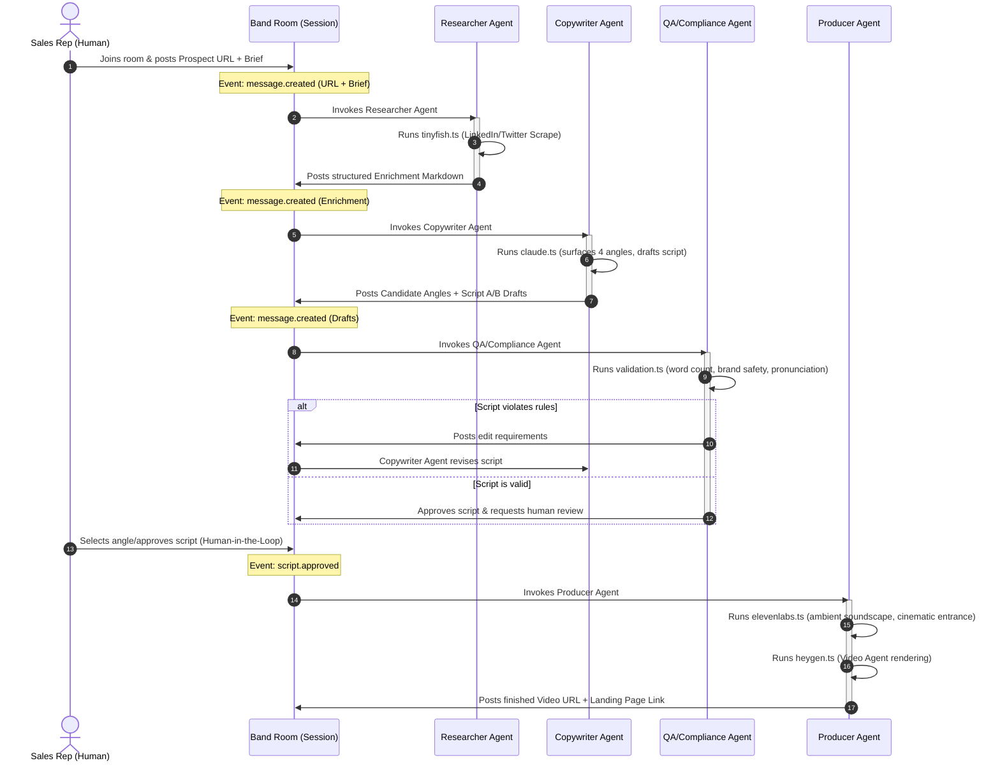

# Band of Agents Hackathon: Integration Plan & Architecture

This document outlines the design and implementation strategy to adapt **nuncio** from a linear personalization pipeline into a collaborative, multi-agent workspace using **Band**.

---

## 1. Core Principles Alignment

Our implementation strictly follows the Nuncio Core Principles to prevent codebase drift and technical debt.

| Principle | Strategic Alignment in Band Integration |
| :--- | :--- |
| **ENHANCEMENT FIRST** | We will enhance existing pipeline functions (`fetchRecentActivity`, `generateScriptVariants`, and `renderVideo`) and the `/studio` interface instead of building brand new pages or parallel business logic. |
| **CONSOLIDATION** | We will consolidate the standalone voice server (`src/voice-server/index.ts`) into the main production server (`src/server/production.ts`) to avoid managing dual websocket infrastructures. |
| **PREVENT BLOAT** | We will use Band's native lightweight SDK/API to wrap our existing functions. No heavy multi-agent orchestration frameworks (e.g. CrewAI, AutoGen) will be introduced. |
| **DRY** | Core business logic (enrichment, synthesis, validation, rendering) resides solely in `src/lib/`. The Band agents will import and run these exact library functions, matching the HTTP endpoint behaviors. |
| **CLEAN** | Separation of concerns: Band connection wrappers, room state listeners, and agent routing logic will be isolated within a new directory `src/lib/band/`. |
| **MODULAR** | Each agent (Researcher, Copywriter, QA Compliance, Producer) is a decoupled module. Each receives structured events, acts on them, and writes back to the Band Room. |
| **PERFORMANT** | Leverage Nuncio's caching utilities (`src/lib/cache.ts` and `src/lib/redis-cache.ts`) to avoid duplicate scrapers. Long-running rendering steps (HeyGen) will use asynchronous status updates. |
| **ORGANIZED** | Clear file layout mapping directly to Nuncio's domain-driven directory structures. |

---

## 2. System Architecture

The core of the integration is transitioning the linear steps in `src/lib/pipeline.ts` into a message-driven collaborative room in Band. 



---

## 3. Directory Layout

The implementation introduces a dedicated, domain-isolated directory structure:

```
src/
├── lib/
│   ├── band/                    # Band integration root
│   │   ├── client.ts            # Band SDK connection client
│   │   ├── room.ts              # Room creation & token utility
│   │   └── agents/              # Agent logic wrappers
│   │       ├── researcher.ts    # Enriches prospect profile via TinyFish
│   │       ├── copywriter.ts    # Generates angles & scripts via Claude
│   │       ├── reviewer.ts      # Validates content via validation.ts
│   │       └── producer.ts      # Renders audio/video via HeyGen & ElevenLabs
│   └── pipeline.ts              # (Enhanced) Core state machine
├── app/
│   └── api/
│       └── studio/
│           └── band/
│               ├── token/route.ts   # Generates Band tokens for frontend room connection
│               └── webhook/route.ts # Webhook endpoint to catch Band events (for serverless fallback)
├── components/
│   └── band-chat.tsx            # (Enhanced) Real-time agent transcript viewer in Studio UI
└── server/
    └── production.ts            # (Enhanced) Starts Next.js + Speech Engine + Band websocket agents
```

---

## 4. Implementation Steps

### Phase A: Setup & Client Initialization (`src/lib/band/client.ts`)
* Install the Band SDK: `@band-ai/sdk` (or the hackathon-specific equivalent).
* Expose `BAND_API_KEY` and `BAND_WORKSPACE_ID` in env configuration.
* Implement a shared Band client provider. Ensure it is a singleton to adhere to the **DRY** principle.

### Phase B: Agent Code Implementations (`src/lib/band/agents/`)
Wrap our existing domain libraries into agent handlers. Ensure no core logic is duplicated.
1. **Researcher Agent**: Imports `fetchRecentActivity` and `enrichCompany` from `src/lib/tinyfish.ts`.
2. **Copywriter Agent**: Imports `generateScriptVariants` from `src/lib/claude.ts`.
3. **Reviewer Agent**: Imports `validateScript` from `src/lib/validation.ts`.
4. **Producer Agent**: Imports `textToSpeech` and `generateSoundEffect` from `src/lib/elevenlabs.ts`, and `renderVideo` from `src/lib/heygen.ts`.

### Phase C: Production Server Wiring (`src/server/production.ts`)
* Update the main entry point to initialize the Band agent processes during startup alongside the Next.js app and the ElevenLabs Speech Engine.
* The agents will run as long-running daemons listening to the Band room queues/sockets:
  ```typescript
  if (process.env.BAND_ENABLED === "true") {
    const { startBandAgents } = await import("../lib/band/client");
    startBandAgents();
  }
  ```

### Phase D: Studio UI Enhancement (`src/app/studio/studio-client.tsx`)
* Enhance the Studio UI to show the agent coordination transparently:
  * When a user inputs a URL, instead of showing a simple loading spinner, render a **"Collaborative Session"** panel.
  * Connect the browser to the Band Room via the Band Client WebSocket.
  * Render messages and activities as they flow in from the **Researcher**, **Copywriter**, and **Compliance** agents.
  * The user can read their reasoning, view what was skipped, and click to approve/edit directly in the message thread.

### Phase E: Cleanup & Consolidation
* Deprecate/consolidate `src/voice-server/index.ts` fully into `src/server/production.ts`.
* Validate that no duplicate LLM system prompts exist between `src/lib/claude.ts` and the Copywriter Agent's parameters. Keep all prompts consolidated in the `src/lib/` files.
